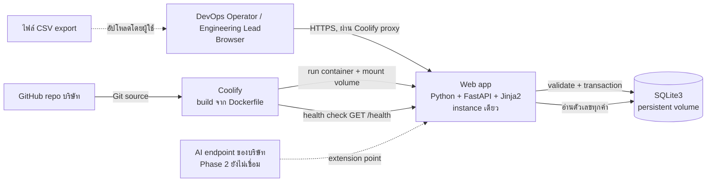

# ARCHITECTURE — Deployment Reliability Dashboard

## System Diagram

ทุก integration ใน CONSTRAINTS.md (IC-01…IC-04) และ dependency ใน SCOPE.md (GitHub, Coolify, AI endpoint) ปรากฏในแผนภาพ เส้นประ = ไม่ใช่ส่วนของ Phase 1

## Tech Stack Decisions
| Layer | Choice | Why not X |
|---|---|---|
| Language/framework | Python 3 + FastAPI | ไม่ใช้ Node/Express: ไม่มีข้อได้เปรียบสำหรับงานนี้และต้องตั้ง toolchain เพิ่ม; ไม่ใช้ Django: หนักเกินสำหรับหน้าเดียวและไม่มี auth/admin |
| UI | Server-rendered Jinja2 | ไม่ใช้ SPA (React): เพิ่ม build step และเวลา โดยไม่มีความต้องการ interactivity ที่ซับซ้อน |
| ฐานข้อมูล | SQLite3 (stdlib `sqlite3`) | ไม่ใช้ DuckDB: โจทย์อนุญาตแต่ข้อมูลระดับหลักหมื่นแถว/instance เดียวไม่ต้องการ columnar engine; ไม่ใช้ PostgreSQL: ต้องมี service เพิ่มบน Coolify เกินความจำเป็น (TC-01, TC-02) |
| Web server | Uvicorn | ไม่ใช้ Gunicorn: instance เดียว ไม่ต้องการ process manager เพิ่ม |
| Packaging | Dockerfile | ไม่ใช้ Nixpacks: Dockerfile ควบคุม non-root user (SC-04) และ volume ได้ตรงกว่า |
| Test | pytest + TestClient | ไม่ใช้ E2E browser tool ใน MVP: เวลาจำกัด; E2E scenario ทำผ่าน HTTP ครอบคลุม CP ทุกข้อ |

สแตกนี้เป็นการตัดสินใจของผู้เขียนเอกสาร (โจทย์ไม่ได้กำหนดภาษา/เฟรมเวิร์ก) บันทึกไว้ใน ADR-001…ADR-004

## Deployment Architecture
- ค่า enum `environment` (เจ้าของ: ARCHITECTURE.md) คือสภาพแวดล้อมที่รันแอป มีค่า `local` และ `coolify` (ใช้ `coolify` เป็นสภาพแวดล้อมใช้งานจริงใน phase นี้ ไม่มี staging แยก)
- Container เดียวจาก Dockerfile; ฐานข้อมูลอยู่ที่ path ที่กำหนดด้วย `DB_PATH` บน volume ที่ mount ถาวร (TC-08)
- รายละเอียดขั้นตอน Coolify อยู่ใน DEPLOYMENT.md (ไม่ซ้ำที่นี่)

## Scalability Strategy
ไม่ขยาย (TC-02): instance เดียว, replica = 1, SQLite เขียนครั้งละหนึ่ง transaction การนำเข้าใช้ `BEGIN IMMEDIATE` เพื่อกันการเขียนซ้อน และเปิด `PRAGMA foreign_keys=ON`; ถ้าล็อกไม่ได้ตอบ `IMPORT_BUSY` (API_SPEC.md) ข้อความ "แสดงครั้งเดียว" หลังอัปโหลดฟอร์มเก็บในหน่วยความจำของ process (ไม่ใช้ cookie) จึงต้องรันเป็น process เดียว; ถ้าเพิ่ม worker/instance ต้องย้ายที่เก็บนี้ก่อน ถ้าต้องขยายใน Phase 3 ต้องย้ายฐานข้อมูลก่อน ค่าเป้าหมายประสิทธิภาพและ auto-scaling trigger = `null` (เจ้าของ: Engineering Lead)

## Third-party Integrations
| Integration | บทบาท | สถานะ |
|---|---|---|
| GitHub (repo บริษัท) | Git source ของ Coolify | Phase 1 |
| Coolify | build และรันคอนเทนเนอร์ | Phase 1 |
| AI endpoint ของบริษัท | สร้างร่างข้อเสนอตรวจสอบจาก failed deployments | Phase 2: extension point — แอปจะมี service module แยกที่อ่านจาก `deployments` (status = failed) และเขียนผลลง ตารางใหม่ ไม่แก้ตารางเดิม; endpoint/โควตา = `null` (owner: ผู้ใช้) |

## Observability & SLOs
- **Logging:** structured log (JSON ต่อบรรทัด) ทุก request มี `correlation_id` (รับจาก header `X-Request-ID` หรือสร้างใหม่) บันทึกผลนำเข้า (batch_id, จำนวนแถว, เหตุผลที่ปฏิเสธ) โดยไม่ log ข้อความ error ทั้งก้อน
- **Metrics:** ไม่มี endpoint metrics: อ่านจาก log (จำนวน request ตาม status code, ระยะเวลานำเข้า, จำนวนการนำเข้าที่ถูกปฏิเสธ) และ Coolify health check ที่ `GET /health`; ฟิลด์ log ขั้นต่ำ `ts`, `level`, `correlation_id`, `event`, `batch_id` (ถ้ามี) `correlation_id` = ค่า header `X-Request-ID` หรือ UUID4 ที่สร้างใหม่
- **Tracing:** ไม่มี (บริการเดียว ไม่มี cross-service request)
- **SLO/SLI:** ยังไม่มีผู้วัดค่า จึงเป็น `null` ทั้งหมด

| SLO | SLI | Target | Traces to | Calibration owner | Alert (ยืนยันแล้วใน RUNBOOK.md Monitoring and Alerts) |
|---|---|---|---|---|---|
| SLO-01 Availability | สัดส่วน health check ที่ตอบ 200 | `null` | NFR-04 | Engineering Lead | health check ล้มเหลวต่อเนื่อง → แจ้งผ่าน Coolify |
| SLO-02 Dashboard latency | เวลาตอบหน้าแดชบอร์ด | `null` | NFR-01 | Engineering Lead | – |
| SLO-03 Import duration | เวลานำเข้าไฟล์ตัวอย่าง | `null` | NFR-02 | DevOps Operator | – |
