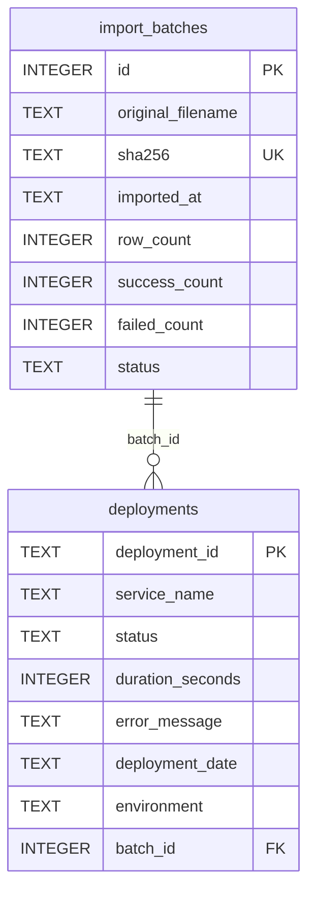

# DATA_MODEL — Deployment Reliability Dashboard

ฐานข้อมูล: SQLite3 (ARCHITECTURE.md) มี **2 ตาราง**: `import_batches`, `deployments` (รายการในหัวข้อ Table Definitions)

## Entity Relationship Diagram

## Table Definitions

### `import_batches`
บันทึกไฟล์ที่นำเข้าสำเร็จเท่านั้น (ไฟล์ที่ถูกปฏิเสธไม่สร้างแถว)

| Column | Type | Constraint | Description |
|---|---|---|---|
| `id` | INTEGER | PK, autoincrement | รหัส batch |
| `original_filename` | TEXT | NOT NULL | ชื่อไฟล์ที่ผู้ใช้อัปโหลด |
| `sha256` | TEXT | NOT NULL, UNIQUE | checksum ของเนื้อไฟล์ ใช้ตรวจไฟล์ซ้ำ (CP-05) |
| `imported_at` | TEXT | NOT NULL | เวลานำเข้า ISO 8601 (UTC) |
| `row_count` | INTEGER | NOT NULL | จำนวนแถวที่นำเข้า |
| `success_count` | INTEGER | NOT NULL | จำนวนแถวสำเร็จ |
| `failed_count` | INTEGER | NOT NULL | จำนวนแถวล้มเหลว |
| `status` | TEXT | NOT NULL | ค่าตาม `import_batch_status` (มีค่าเดียวใน MVP เก็บไว้เพื่อให้ Phase 2/3 เพิ่มสถานะได้โดยไม่เปลี่ยนสคีมา) |

### `deployments`
| Column | Type | Constraint | Description |
|---|---|---|---|
| `deployment_id` | TEXT | PK | รหัส deployment จาก CSV ไม่ซ้ำทั้งระบบ ห้ามเขียนทับ |
| `service_name` | TEXT | NOT NULL, ไม่ว่าง | ชื่อบริการ |
| `status` | TEXT | NOT NULL | ค่าตาม `deployment_status` |
| `duration_seconds` | INTEGER | NOT NULL, > 0 | ระยะเวลาเป็นวินาที |
| `error_message` | TEXT | NOT NULL, default `''` | ว่างเมื่อ success; ไม่ว่างเมื่อ failed |
| `deployment_date` | TEXT | NOT NULL | วันที่ ISO `YYYY-MM-DD` |
| `environment` | TEXT | NOT NULL, ไม่ว่าง | ปลายทางที่ deploy (ข้อความอิสระจาก CSV) |
| `batch_id` | INTEGER | NOT NULL, FK → `import_batches.id` | batch ที่นำเข้า |

**Indexes:** `deployment_id` (unique ผ่าน PK), `service_name`, `status`, `deployment_date`

### Enums (เจ้าของ: เอกสารนี้)
| Enum | Value | ความหมาย |
|---|---|---|
| `deployment_status` | `success` | deployment สำเร็จ |
| `deployment_status` | `failed` | deployment ล้มเหลว ต้องมี error_message |
| `import_batch_status` | `imported` | นำเข้าสำเร็จครบทั้งไฟล์ (ไฟล์ที่ล้มเหลวไม่ถูกเก็บ จึงมีค่าเดียว) |

## Data Classification
| Value ของ `pdpa_classification` | ความหมาย |
|---|---|
| `non_personal` | ไม่ใช่ข้อมูลส่วนบุคคลตาม PDPA |
| `personal` | ข้อมูลส่วนบุคคล (ไม่มีใน MVP) |

| Value ของ `confidentiality_class` | ความหมาย |
|---|---|
| `internal` | ใช้ภายในองค์กรเท่านั้น ห้ามเปิดสาธารณะ |
| `public` | เปิดเผยได้ |

| Field | pdpa_classification | confidentiality_class | เหตุผล |
|---|---|---|---|
| `deployments.deployment_id` | `non_personal` | `internal` | รหัสภายใน |
| `deployments.service_name` | `non_personal` | `internal` | เปิดเผยโครงสร้างบริการ |
| `deployments.status` | `non_personal` | `internal` | |
| `deployments.duration_seconds` | `non_personal` | `internal` | |
| `deployments.error_message` | `non_personal` | `internal` | อาจมีชื่อ host/dependency ภายใน |
| `deployments.deployment_date` | `non_personal` | `internal` | |
| `deployments.environment` | `non_personal` | `internal` | |
| `deployments.batch_id` | `non_personal` | `internal` | |
| `import_batches.*` | `non_personal` | `internal` | metadata การนำเข้า (`original_filename` ต้องไม่ใส่ข้อมูลส่วนบุคคล) |

ไม่มีฟิลด์ใดเก็บข้อมูลผู้ใช้ จึงไม่มีขั้นตอน erasure ถ้าเพิ่มข้อมูลส่วนบุคคลในอนาคต ต้องอัปเดตตารางนี้ก่อน (LC-02)

## Data Retention Policy
| Data | Retention | แหล่งที่มา / เจ้าของ |
|---|---|---|
| `deployments` | `null` | Engineering Lead (ต้องตัดสินก่อน Phase 3; MVP เก็บไม่จำกัด) |
| `import_batches` | `null` | Engineering Lead |
| Audit log | `null` (ไม่มีตาราง audit log ใน MVP เพราะไม่มี auth) | Engineering Lead เป็นเจ้าของค่านี้ที่นี่ที่เดียว SECURITY.md อ้างถึงเอกสารนี้ |

## Migration Strategy
- Schema สร้างด้วย `CREATE TABLE IF NOT EXISTS` ตอนเริ่มแอป ไม่มี migration tool ใน MVP
- การเปลี่ยน schema/data contract ต้องบันทึกในเอกสารนี้และ PRD.md ก่อนแก้โค้ด
- การแก้ schema ใน Phase 2/3 ทำเป็นสคริปต์ที่ใส่ลำดับเลขเวอร์ชัน และต้องสำรองไฟล์ฐานข้อมูลบน volume ก่อน
- Phase 2 เพิ่มตารางใหม่ (ตาม ARCHITECTURE.md Third-party Integrations) ไม่แก้ตารางเดิม
