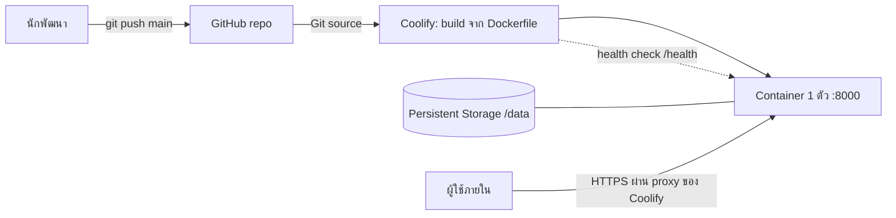

# DEPLOYMENT — Deployment Reliability Dashboard

> **สถานะ: Concept (ยังไม่ได้ deploy บน Coolify)** ผู้ใช้จะ deploy เอง (2026-10-02) เอกสารนี้จึงเป็นแผนที่ออกแบบไว้ล่วงหน้า ส่วนที่ตรวจแล้วจริงมีเฉพาะการรัน Docker image ในเครื่อง (non-root, volume, health, ข้อมูลอยู่หลัง restart) ขั้นตอนบน Coolify ยังไม่เคยทดลอง ต้องยืนยันตอน deploy จริง ดู "Concept: Coolify" ด้านล่าง

ไม่มี credential, URL ภายใน หรือชื่อบริษัทในเอกสารนี้: ใช้ placeholder `<COMPANY_REPO_URL>`, `<COOLIFY_HOST>`

## Environment Setup
ค่าของ enum `environment` นิยามที่ ARCHITECTURE.md (Deployment Architecture) ที่นี่อธิบายเฉพาะวิธีตั้งค่าแต่ละสภาพแวดล้อม:

| สภาพแวดล้อม | วิธีรัน | ฐานข้อมูล |
|---|---|---|
| ในเครื่องนักพัฒนา | `uvicorn app.main:app` | `data/dashboard.db` (ไม่ commit) |
| บน Coolify | คอนเทนเนอร์จาก Dockerfile ที่ Coolify build จาก `<COMPANY_REPO_URL>` | `/data/dashboard.db` บน persistent volume |

### Container contract (สิ่งที่ Dockerfile ต้องทำ)
- base image `python:3.12-slim`; ติดตั้งจาก `requirements.txt` (`fastapi`, `uvicorn`, `jinja2`, `python-multipart`) โดย pin เวอร์ชันที่ผ่าน test ตอน implement; dev: `pytest`, `httpx`
- ผู้ใช้ non-root ชื่อ `app`; สร้าง `/data` และ `chown app` ใน image
- bind `0.0.0.0:8000`; `HEALTHCHECK` เรียก `GET /health` ด้วย Python stdlib (ไม่เพิ่ม `curl`)
- **ข้อควรระวังสิทธิ์ volume:** volume ที่ Coolify mount อาจเป็นของ root ทำให้ user `app` เขียน `/data` ไม่ได้ ถ้า `/health` ผ่านแต่การนำเข้าล้มเหลวด้วย error เขียนไฟล์ ให้ตั้งสิทธิ์ของ mount ให้ user `app` เขียนได้ (TST-019)

### Concept: Coolify (ยังไม่ได้ทดลอง)

| ตั้งค่าใน Coolify | ค่าที่วางแผน | สถานะการยืนยัน |
|---|---|---|
| Source | repo + branch `main` | ยังไม่ยืนยัน (ต้องมีสิทธิ์อ่าน repo) |
| Build pack | Dockerfile (root) | Dockerfile build ผ่านในเครื่อง |
| Port | 8000 | ยืนยันในเครื่อง |
| Persistent Storage | mount ที่ `/data` | ยืนยันด้วย Docker volume ในเครื่อง; บน Coolify ยังไม่ยืนยัน และต้องดูสิทธิ์เขียนของ user `app` |
| Health check | path `/health` | ยืนยันในเครื่อง (`healthy`) |
| Replica | 1 | – |
| การเข้าถึง | เฉพาะเครือข่ายภายใน | ยังไม่ยืนยัน (LB-3) |
| Domain / TLS | `<COOLIFY_HOST>` | ยังไม่ยืนยัน |
| `MAX_UPLOAD_BYTES` | ค่าเริ่มต้น 10 MiB ไม่ต้องตั้ง | proxy ของ Coolify ต้องไม่จำกัดต่ำกว่านี้ (LB-4) |

**สิ่งที่ต้องพิสูจน์ตอน deploy จริง** (ตรงกับ TESTING.md E2E-06 และ CP-06): `/health` = 200 บน URL ของ Coolify → อัปโหลด CSV → redeploy → ตัวเลขเดิมยังอยู่ → ลองอัปโหลดไฟล์ >10 MB แล้วเห็นข้อความของแอป ไม่ใช่ error ของ proxy

### Launch Blockers
ต้องปิดครบก่อนถือว่า T-12 เสร็จ

| # | รายการ | เจ้าของ |
|---|---|---|
| LB-1 | `<COMPANY_REPO_URL>` และสิทธิ์ push | ผู้ใช้ |
| LB-2 | Coolify instance + Git source พร้อมใช้ | DevOps Operator |
| LB-3 | ยืนยันการจำกัดเครือข่ายแล้วลองเข้าจากภายนอกถูกปฏิเสธ (SC-01) | DevOps Operator |
| LB-4 | ยืนยันว่าขีดจำกัดของ Coolify/reverse proxy **ไม่ต่ำกว่า** 10 MiB (TC-07) ถ้าต่ำกว่า proxy จะตัดคำขอก่อนถึงแอปและผู้ใช้จะไม่เห็นข้อความเตือนที่ถูกต้อง | DevOps Operator |
| LB-5 | Persistent volume mount ที่ `/data` และเขียนได้ | DevOps Operator |

ไม่มี staging แยก; deployment_strategy ใช้ `recreate` (เจ้าของ enum `deployment_strategy` ที่นี่: ค่า `recreate`, `rolling`, `blue_green`; โปรเจกต์นี้ใช้เฉพาะ `recreate` ตาม ADR-004)

## CI/CD Pipeline
| Step | ที่ไหน | รายละเอียด |
|---|---|---|
| 1 Test | เครื่องนักพัฒนา | รันชุด test ตาม TESTING.md ต้องผ่านก่อน push (BC-01) |
| 2 Push | เครื่องนักพัฒนา → GitHub | push ไป `<COMPANY_REPO_URL>` บันทึก commit SHA |
| 3 Backup | ผู้ deploy | ก่อน redeploy ที่เปลี่ยน schema: `sqlite3 /data/dashboard.db ".backup /data/backup-<YYYYMMDD>.db"` (ทำใน terminal ของคอนเทนเนอร์เดิม) |
| 3a Build | Coolify | build image จาก `Dockerfile` ที่ root ของ repo |
| 4 Deploy | Coolify | หยุดคอนเทนเนอร์เก่า เริ่มใหม่ mount volume เดิม |
| 5 Verify | ผู้ deploy | `GET /health` = 200 และเปิดหน้า Dashboard ได้ |

ไม่มี CI รันอัตโนมัติบน GitHub ใน Phase 1 (เพิ่มได้ Phase 3: workflow ที่รัน test ก่อน Coolify deploy) จึงไม่มีการบล็อกอัตโนมัติ การรัน test เป็นหน้าที่ผู้ push

### ตั้งค่าใน Coolify (ครั้งแรก)
1. สร้าง Application จาก Git source `<COMPANY_REPO_URL>` branch `main`, build pack = Dockerfile
2. Port ที่เปิด = `8000`
3. เพิ่ม Persistent Storage: mount ไปที่ `/data` (TC-08)
4. ตั้ง replica = 1 (TC-02) และ health check path = `/health`
5. **จำกัดการเข้าถึงให้เฉพาะเครือข่ายภายใน** ก่อนเปิดใช้งาน (SC-01; แอปไม่มี auth)
6. Deploy

## Environment Variables
| Variable | จำเป็น | ค่า | หมายเหตุ |
|---|---|---|---|
| `DB_PATH` | ไม่ | `/data/dashboard.db` (ตั้งใน Dockerfile) | ตำแหน่งไฟล์ SQLite ต้องอยู่บน volume |
| `MAX_UPLOAD_BYTES` | ไม่ | `10485760` (10 MiB) | ขีดจำกัดขนาดไฟล์อัปโหลด (TC-07) เจ้าของ DevOps Operator; ค่าต้องเป็นจำนวนเต็มบวก หน้าเว็บอ่านค่านี้ไปใช้เตือนฝั่ง client ด้วย (ไม่ hard-code ซ้ำ) |

ไม่มี secret ใน Phase 1 ถ้ามีในอนาคตเก็บที่ Coolify environment variables เท่านั้น (SC-05)

## Rollback Procedure
1. ใน Coolify เลือก deployment ก่อนหน้าที่ทำงานได้ แล้วสั่ง redeploy (หรือ revert commit แล้ว push)
2. ตรวจ `GET /health` = 200
3. ตรวจว่าข้อมูลยังอยู่ (ตัวเลขรวมบน Dashboard ตรงกับก่อน deploy) เพราะ volume ไม่ถูกลบ
4. ถ้า schema เปลี่ยน ให้กู้ไฟล์สำรองจากขั้น 3 (Backup) ใน CI/CD Pipeline ตาม DATA_MODEL.md Migration Strategy
ห้ามลบ volume เพื่อ rollback เพราะข้อมูลจะหายและตรวจสอบ CP-06 ไม่ผ่าน

**การแก้ไข import ที่ผิด (ไม่มีฟีเจอร์ลบ/รีเซ็ตในแอป):** หยุดคอนเทนเนอร์ → กู้ไฟล์สำรองล่าสุดหรือลบเฉพาะไฟล์ `dashboard.db` บน volume (ข้อมูลทั้งหมดหาย) → เริ่มใหม่แล้วนำเข้าไฟล์ที่ถูกต้อง การลบทั้งฐานเป็นการตัดสินใจของ DevOps Operator และต้องมีไฟล์ CSV ต้นฉบับ เพราะแอปไม่รองรับลบเป็น batch ใน Phase 1

## Health Check Endpoints
| Path | ตอบ | ใช้โดย |
|---|---|---|
| `GET /health` | 200 `{"status":"ok"}` เมื่อเปิดฐานข้อมูลได้ | Coolify health check, Docker HEALTHCHECK |

## Zero-downtime Deployment
**ไม่ทำ** zero-downtime ใน Phase 1 เจตนา: SQLite รองรับผู้เขียนทีละ process หาก rolling update รัน 2 instance บน volume เดียวกัน เสี่ยงล็อก/เสียหาย (TC-02, ADR-004) จึงใช้ `recreate`: มีช่วงหยุดสั้นขณะคอนเทนเนอร์เริ่มใหม่ ความยาวช่วงหยุด = `null` (เจ้าของ: DevOps Operator วัดจากการ deploy ครั้งแรก) Phase 3 ถ้าต้อง zero-downtime ต้องย้ายไปฐานข้อมูลที่รองรับหลาย writer ก่อน
