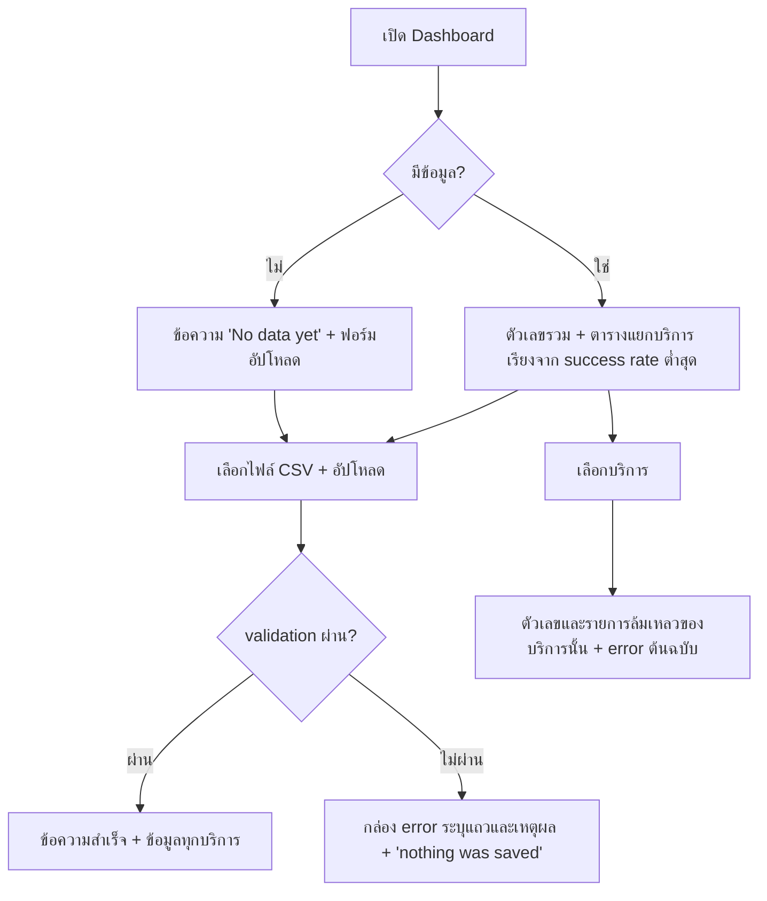

# UI_SPEC — Deployment Reliability Dashboard

## Page Inventory
มี **1 หน้า** (server-rendered) และ endpoint ฟอร์ม 1 รายการ

| Route | Page | Method | คำอธิบาย |
|---|---|---|---|
| `/` | Dashboard | GET | แสดงส่วน Import, ตัวกรองบริการ, ตัวเลขรวม, ตารางแยกบริการ, รายการ failed deployment; query: `service`, `environment` (P1), `page` (ดู API_SPEC.md) |
| `/upload` | (ไม่มีหน้าของตัวเอง) | POST | รับฟอร์มอัปโหลด CSV สำเร็จ = redirect 303 ไป `/` พร้อมข้อความผลนำเข้า (กด refresh ได้โดยไม่ส่งไฟล์ซ้ำ); ผิดพลาด = เรนเดอร์ Dashboard พร้อมกล่อง error |

## User Flow Diagrams


### Critical Path Trace
เฉพาะ CP-ID ที่ PERSONAS.md กำหนด `Delivery = UI` (CP-05 และ CP-06 เป็น `system` ไม่ปรากฏที่นี่)

| CP-ID | Route | ขั้นตอนบน UI |
|---|---|---|
| CP-01 | `/upload` → `/` | เลือกไฟล์ถูกต้อง → อัปโหลด → เห็นข้อความสำเร็จและข้อมูลทุกบริการ |
| CP-02 | `/` (`?service=`) | เลือกบริการจาก dropdown → ตัวเลขและรายการล้มเหลวเหลือเฉพาะบริการนั้น พร้อมข้อความ error |
| CP-03 | `/` | ตารางแยกบริการเรียงจาก success rate ต่ำสุด; แถวแรกคือจุดเริ่มตรวจสอบ |
| CP-04 | `/upload` | ไฟล์ผิดกติกา หรือไฟล์เกิน 10 MB → กล่อง error (role=alert) ระบุแถวและเหตุผล (หรือข้อความขนาดไฟล์) ข้อมูลเดิมไม่เปลี่ยน |

## Component Hierarchy
```
Dashboard (/)
├─ ImportForm            ไฟล์ + ปุ่ม Upload (ข้อความข้างช่องไฟล์: "CSV, max 10 MB")
├─ UploadSizeWarning     เตือนทันทีที่เลือกไฟล์ใหญ่เกินขีดจำกัด (role=alert) และปิดปุ่ม Upload
├─ StatusMessage         สำเร็จ (role=status) / ปฏิเสธ (role=alert, รายการเหตุผล)
├─ ServiceFilter         <select> ทุกบริการ + รายชื่อบริการทั้งหมดที่มีในฐานข้อมูล (ไม่ผูกกับ filter ที่เลือกอยู่; ส่งฟอร์มเมื่อเปลี่ยน)
├─ KpiCards              Deployments · Successful · Failed · Success rate · Avg successful duration (s)
├─ ServiceTable          Service · Deployments · Failed · Success rate · Avg successful duration (s)
└─ FailureTable          Deployment · Service · Env · Date · Duration (s) · Error message  (+ Pagination)
```

## State Management Plan
ไม่มี state ฝั่ง client สถานะอยู่ใน URL และฐานข้อมูล:
- `service` (query) ว่าง = ทุกบริการ; ค่าที่ไม่มีอยู่แสดงผลศูนย์แถว ไม่ error
- `page` (query) หน้าของรายการล้มเหลว ขนาดหน้า = 100 แถว (`offset = (page − 1) × 100`); `page` ที่ไม่ใช่ตัวเลขหรือ < 1 ถือเป็น 1; เกินหน้าสุดท้ายแสดงรายการว่างพร้อมลิงก์ Prev; ควบคุมด้วยลิงก์ Prev/Next และข้อความ "Page N / M"
- ผลนำเข้าอยู่ในการตอบกลับของ POST เท่านั้น (ไม่มี session)
- ตัวเลขทุกค่าอ่านจาก SQLite ต่อ request (TC-05)

## Responsive Breakpoints
| Breakpoint | ความกว้าง | พฤติกรรม |
|---|---|---|
| mobile | < 640px | KPI 1–2 คอลัมน์; ตารางเลื่อนแนวนอนในกรอบ |
| desktop | ≥ 640px | KPI เรียงแถว; ตารางเต็มความกว้าง (max 1100px) |

## Design Tokens
| Token | Light | Dark | หมายเหตุ |
|---|---|---|---|
| `--bg` | #f6f7f9 | #14171a | พื้นหลังหน้า |
| `--fg` | #1b1f24 | #e6e8ea | ข้อความ |
| `--muted` | #5b6571 | #9aa4af | ข้อความรอง |
| `--card` | #ffffff | #1d2125 | พื้นการ์ด/ตาราง |
| `--bad` | #c62828 | #ef6b6b | success rate < 85% |
| `--warn` | #9a5b00 | #f0a93a | 85% ≤ rate < 90% |
| `--good` | #2e7d32 | #5cc16a | rate ≥ 90% |
| `--accent` | #1f5fbf | #6aa3ff | ลิงก์/พื้นปุ่ม |
| `--on-accent` | #ffffff | #14171a | ข้อความบนปุ่ม |
**การเตือนขนาดไฟล์ (NFR-03, TC-07):** ฟอร์มมี `data-max-bytes` ตามค่า `MAX_UPLOAD_BYTES` (ไม่ hard-code 10 MB ใน JavaScript) เมื่อผู้ใช้เลือกไฟล์ที่ `file.size` เกิน JavaScript ต้องแสดงข้อความ `File is X.X MB; the maximum is 10 MB. Nothing was uploaded.` ในกล่อง `role="alert"` ทันที และปิดปุ่ม Upload ไว้จนกว่าจะเลือกไฟล์ใหม่ที่ไม่เกิน ถ้า JavaScript ปิดอยู่หรือถูกเลี่ยง server ปฏิเสธด้วย `FILE_TOO_LARGE` 413 และแสดงข้อความ `File exceeds the maximum of 10 MB.` ในกล่อง error ของหน้า (ไม่มีขนาดจริง เพราะ server หยุดอ่านทันที; CP-04 ครอบคลุมเส้นทางนี้) ตัวเลข "10 MB" ในข้อความมาจากค่าตั้งค่า ไม่ใช่ข้อความตายตัว

ข้อความหลักของ UI (เจ้าของ copy): ว่าง = "No data yet. Upload a deployment-history CSV to begin."; สำเร็จ = "Imported N deployments (S successful, F failed)."; ปฏิเสธ = "Import rejected — nothing was saved." ตามด้วยรายการเหตุผล; ค่า null ของ rate/duration แสดง "–"; ปุ่ม "Upload"
โหมดสว่าง/มืดเลือกตาม `prefers-color-scheme` ของเบราว์เซอร์ (ไม่มีปุ่มสลับ)

Contrast ที่คำนวณแล้ว (ข้อความเทียบกับ `--card`; ข้อความปุ่มเทียบกับ `--accent`): สว่าง bad 5.62, warn 5.43, good 5.13, accent 6.09, muted 5.92, ปุ่ม 6.09; มืด bad 5.39, warn 8.05, good 7.17, accent 6.40, muted 6.40 — ทุกค่า ≥ 4.5:1 (ปุ่มโหมดมืดต้องคำนวณใหม่เมื่อ implement เพราะ `--on-accent` ใหม่ ต้อง ≥ 4.5:1)

Typography: system font stack ขนาดฐาน 14px; ตัวเลขในตารางใช้ tabular-nums

เกณฑ์สี 85% และ 90% เป็น **ค่าสอนสำหรับตัวอย่าง (illustrative)** ไม่ใช่มาตรฐานอุตสาหกรรม ใช้เป็นค่าคงที่ในโค้ดเพียงเพื่อแสดงผลของ MVP โดยไม่กระทบตัวเลข; ค่าที่ calibrate แล้ว = `null` เจ้าของ Engineering Lead (ความเสี่ยงกับ Phase 3 เมื่อเกณฑ์จริงต่างจากนี้)

## Accessibility Guidelines
- เป้าหมาย: **WCAG 2.1 ระดับ AA**
- Contrast: ข้อความปกติ ≥ **4.5:1**; ข้อความใหญ่และองค์ประกอบ UI ≥ **3:1** ทั้งธีมสว่างและมืด
- ห้ามใช้สีอย่างเดียวบอกสถานะ: แสดงตัวเลข % ควบคู่เสมอ
- Form มี `<label>`; ข้อความสำเร็จ `role="status"`, ข้อผิดพลาด `role="alert"`; ตารางใช้ `<th>` และ `<thead>`
- ใช้งานด้วยคีย์บอร์ดได้ทั้งหมด; dropdown มี `<noscript>` ปุ่ม Apply สำรอง

## i18n & Content Strategy
- Locale ที่รองรับ: `en` (ค่าเริ่มต้น) — fallback: `en`
- ข้อความ UI เป็นภาษาอังกฤษ เพราะผู้ใช้เป็นทีม DevOps ที่คุ้นศัพท์เทคนิค ข้อความ error จากข้อมูลแสดงตามต้นฉบับโดยไม่แปล
- ไม่รองรับหลาย locale ใน MVP; `th` เป็นตัวเลือก Phase 3 (fallback: `en`)
- วันที่แสดง ISO `YYYY-MM-DD`; ระยะเวลาแสดงเป็นวินาที
